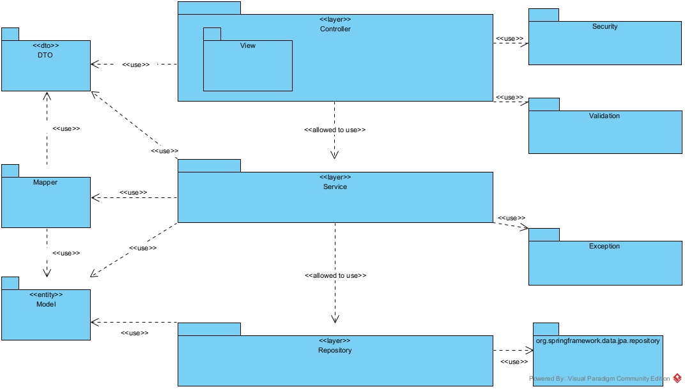
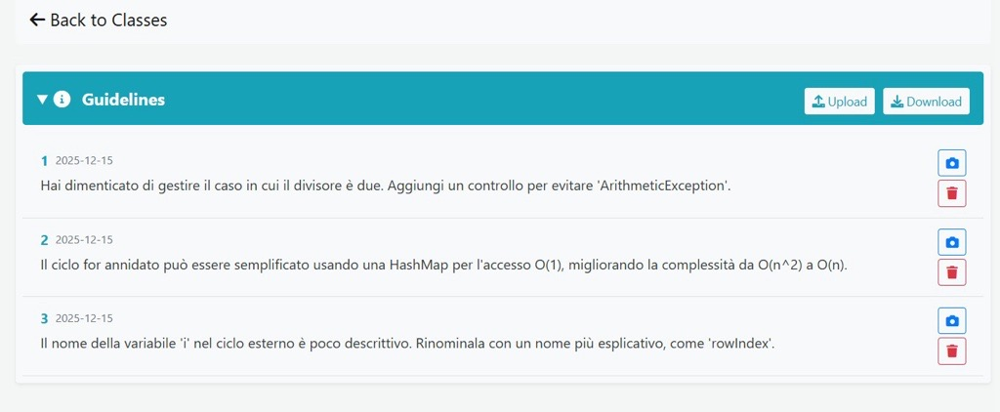
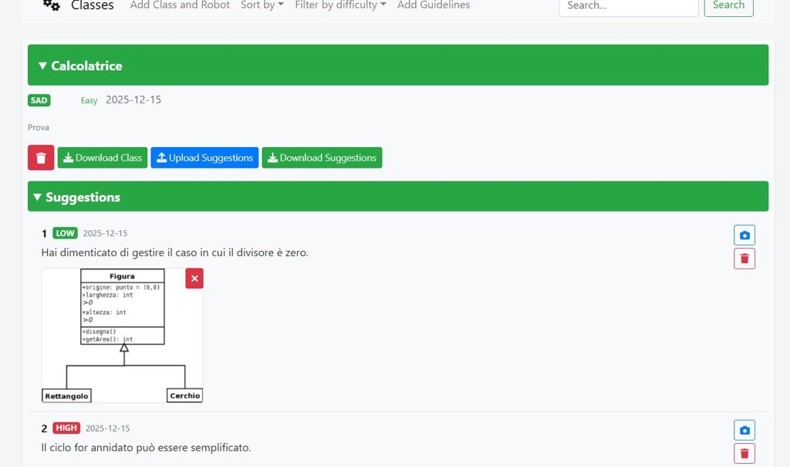
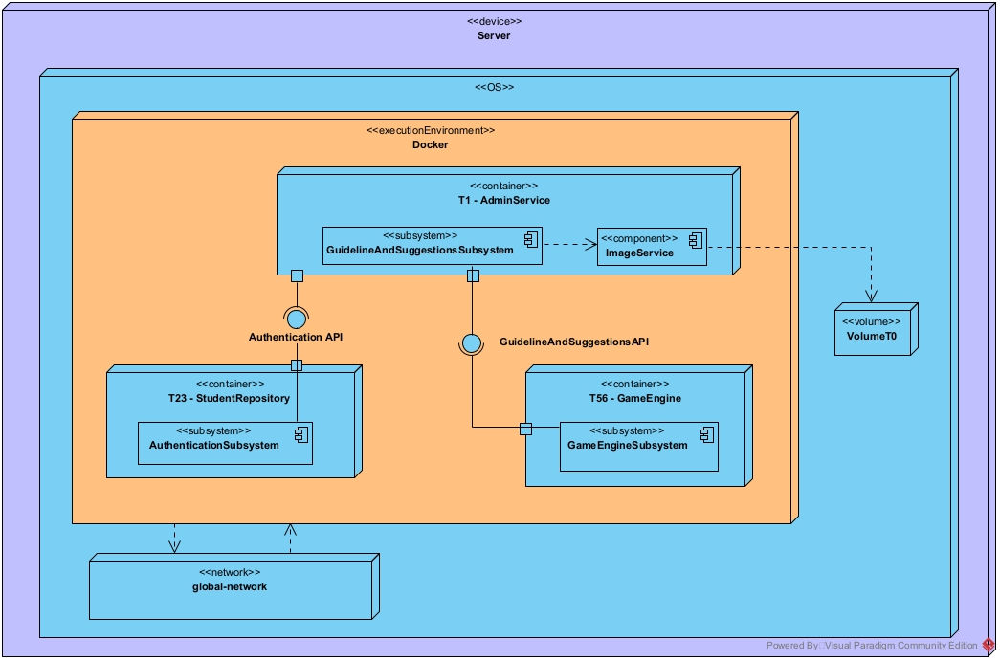

# Task R2
Gruppo **D9**

Componenti del gruppo:
- Saggiomo Luca - luc.saggiomo@studenti.unina.it
- Cinque Salvatore - salva.cinque@studenti.unina.it
- Gargiulo Salvatore - salvatore.gargiulo19@studenti.unina.it
- Russo Claudio - claudio.russo10@studenti.unina.it

Microservizio interessato : T1

## 0. Descrizione del Task
Il task R2 presenta due principali interventi sul microservizio T1. 

1. Il primo riguarda la migrazione del database da uno non relazionale, MongoDB, ad uno relazionale. La scelta iniziale di progetto di adottare un database non relazionale influiva negativamente sulla facilità di modifica ed evoluzione del servizio, data la poca leggibilità delle query Mongo, specialmente per chi proviene da SQL, e la mancanza di vincoli relazionali e ottimizzazioni di query e transazioni. La nuova scelta di progetto, ossia quella di migrare a MySql, è stata proprio guidata da tali requisiti. Un altro vincolo fondamentale è quello di implementare la migrazione in modo tale che essa impatti il meno possibile sulla gestione della persistenza del microservizio. 

2. Il secondo, invece, riguarda l'aggiunta di nuove funzionalità per l'admin in T1 per permettergli di inserire dei suggerimenti, utili agli studenti durante le partite, tramite un file di testo con formato scelto correttamente. 


## 1. Implementazione del task
### Migrazione del database
Il primo step è stato quello di effettuare la migrazione del database, che ha impattatato solamente il microservizio T1, come da richiesta. I dati sono stati, dunque, riorganizzati in tabelle relazionali, senza però stravolgere il dominio applicativo. Sono state introdotte, dunque, entità normalizzate, chiavi primarie e vincoli di integrità. A livello implementativo, le collezioni MongoDb sono state convertite in entità JPA, annotate nel codice come @Entity, e su cui è stato possibile stilare tabelle, grazie all'annotazione @Table, popolandole con attributi e campi, ancora una volta utilizzando annotazioni Jpa. Le relazioni sono state esplicitate tramite le annotazioni @OneToMany, @ManyToOne e @ManyToMany, con il supporto di altre di join per la definizione di chiavi esterne. È stato possibile introdurre anche vincoli di integrità grazie ancora una volta alle annotazioni (es. @Column(nullable = fale) se il corrispettivo attributo non può assumere valore null). 

L'accesso ai dati è incapsulato nel livello repository, tramite interfacce che estendono "JpaRepository", che vengono implementate da Hibernate. In questo modo è stato possibile implementare e fornire metodi CRUD, query personalizzate (tramite il metodo naming di Spring Data), riducendo la presenza di query esplicite nel codice. Tramite spring è stato possibile anche gestire le transazioni grazie all'annotazione @Transactional. 

### Suggerimenti
Per l'aggiunta della funzionalità dei suggerimenti, sono state create due nuove entity: Suggestion, i suggerimenti appunto, e Guideline. La prima estende la seconda, che rappresenta delle linee guida generali applicabili ad ogni classe, aggiungendo, appunto, la dipendenza da una specifica classe. Tale attributo, insieme al campo level, differenzia Guidelines e Suggestions, che possiedono come campi comuni un ordine progressivo, rappresentato da un intero, una stringa testuale, che rappresenta la descrizione del suggerimento, e una data di creazione. Per rispettare la forma normale, sono state implementate due tabelle differenti. Per la gestione delle richieste relative a tali entità, sono stati introdotti nuovi endpoint REST, con la conseguente introduzione di RestController, responsabili dell'esposzione di RestApi per la creazione, il recupero, l'aggiornamento e la cancellazione delle due entità. Per seguire il principio di separazione delle responsabilità, il controller delega la logica applicativa al Service, che a sua volta interagisce con i mapper, utili a mappare i DTO in classi model, e viceversa.

#### Post dei suggerimenti
Per inserire dei suggerimenti, l'admin deve caricare un file in formato Json, dove in prima riga troviamo il nome della classe a cui aggiungerli, e poi il blocco di suggestion da inserire, specificandone ordine progressivo, che verrà approfondito successivamente, contenuto testuale e livello. Nel caso in cui vengano inseriti uno o più suggerimenti che già esistono nel database, il loro contenuto testuale e il loro livello vengono aggiornati con i nuovi valori. Dunque per l'inserimento la chiamata effettuata è di tipo upsert, e viene mappata dalla chiamata http POST "/suggestions/upload". Di seguito viene mostrato un esempio di caricamento di due suggerimenti per la classe calcolatrice: 
```json
{
    "className" : "Calcolatrice", 
    "suggestion" : [
        {
            "order" : "1",
            "hint" : "Testo Suggerimento 1", 
            "level" : "LOW"
        },
        {
            "order" : "2",
            "hint" : "Testo Suggerimento 2", 
            "level" : "HARD"
        }
    ]
}
```
Per le guideLine il ragionamento è molto simile al caso dei suggerimenti, con l'unica differenza che qui il campo className è omesso, in quanto generiche per ogni classe, così come il livello. 
```json
[
    {
        "order" : "1",
        "hint" : "LineaGuida1"
    },
    {
        "order" : "2",
        "hint" : "Testo LineaGuida 2",
    }        
]
```
#### Criteri di accettazione 
Il sistema, in generale, permette di eseguire le operazioni di post, get e delete solo se provengono dall'admin, tramite un controllo interno, restituendo status code Unauthorized 401 nel caso in cui l'operazione provenga da un altro utente. 

Nel caso di richieste POST, il sistema controlla la validità del file JSON, andando a verificarne anche i campi, e nel caso di validità risponde con uno status code 200 e con una stringa di avvenuto caricamento. Inoltre, gestisce anche i casi in cui il json body della richiesta sia mancante, oppure in caso vengano caricati suggerimenti duplicati, rispondendo con uno status code 400, un messaggio di errore e non toccando il database. Potrebbe avvenire anche che la richiesta non contenga dei campi chiave, come ad esempio la classe nel caso dei suggerimenti, ed in quel caso il server risponde con un error 404 NotFound. 

Un ulteriore controllo è effettuato sull'ordine associato ai suggerimenti, che deve obbligatoriamente partire da 1 ed essere progressivo. 

#### Get e delete di suggerimenti 
L'admin può richiedere una lista di suggerimenti appartenenti a una classe tramite la chimata GET "/suggestions/{className}", ricevendo come risposta dal sistema o 200 e il json contenente i suggerimenti, nel caso la richiesta sia andata a buon fine, o 400 badRequest, nel caso la richiesta abbia dei campi non validi (come la classe con valore null, empty o composta da soli spazi), oppure 404 NotFound nel caso in cui la classe inserita nella richiesta non esista.

L'admin può anche effettuare la cancellazione di un suggerimento, tramite la chiamata delete "/suggestions/{className}/{order}", specificando dunque nome della classe e ordine progressivo. Anche qui il sistema potrà rispondere con 200, 400 o 404.

#### Immagini associate a suggerimenti e linee guida
Un'altra introduzione riguarda la possibilità di inserire, aggiornare o cancellare un'immagine associata a un suggerimento o a una linea guida, rispettando il vincolo per la quale questi ultimi possono esser dotati di una sola immagine.
Nel caso si aggiunga l'immagine ad un suggerimento che già ne possiede una, essa viene sovrascritta (prima cancellata e poi aggiunta la nuova).
Anche qui sono stati definiti nuovi endpoint REST per la gestione delle operazioni sulle immagini ("/suggestions/upload/{className}/ per la post, "/suggestions/image/{className}/{order}" per la delete). Nel caso dell'inserimento, il file inserito è un MultiPartFile, utilizzato per l'invio di file complessi, di dimensione massima 5MB.
 
Le immagini sono memorizzate nel filesystem, all'interno del volume T0 nel path "/VolumeT0/FolderTree/Images/", con il formato seguente: `{nomeClasse}_{order}.{estensione}`
 
Le estensioni supportate sono: `"image/png"`, `"image/jpeg"`, `"image/jpg"`, `"image/xbm"`, `"image/tif"`, `"image/jfif"`, `"image/ico"`, `"image/gif"`, `"image/svg"`, `"image/svgz"`, `"image/webp"`,`"image/bmp"`, `"image/pjp"`, `"image/apng"`, `"image/pjpeg"`, `"image/avif"`.
 
Nel caso delle lineeGuida, non essendoci il nome della classe, il formato dell'immagine è il seguente: `{order}.{estensione}`

### Separazione delle responsabilità
Una delle problematiche riscontrate nella vecchia versione del codice riguardava la mancata separazione degli interessi, delle logiche e delle responsabilità tra i vari componenti del sistema. Alcuni blocchi, come ad esempio i controller, si trovavano a gestire, oltre la logica di controllo, anche altre logiche che non rientravano nel loro interesse, o in alcuni casi, creando ridondanza. 

#### GlobalExceptionHandler
Per migliorare la modularità e la chiarezza del codice, è stato introdotta la classe
GlobalExceptionHandler, che ha il compito di gestire tutte le eccezioni generate all'interno
del microservizio. Tale approccio segue il pattern Centralized Exception Handling, che risulta utile nel separare la gestione degli errori dalla logica applicativa. In questo modo, il controller non ha più l'onere di gestire eventuali eccezioni lanciate dalle operazioni. 

#### Sicurezza e Autenticazione
Ad ogni richiesta HTTP va verificato che l'utente sia autenticato. In precedenza ogni metodo dei vari Controller effettuava manualmente un controllo del token JWT. Tuttavia il package security era già predisposto a effettuare questo controllo per ogni richiesta entrante, prima che raggiungesse il Controller, rendendo di conseguenza ridondante il secondo controllo.

### Struttura dei package
 
Di seguito è riportata la struttura ad albero dei package del backend, con una breve indicazione del contenuto principale di ciascun package.
 
```text
com.groom.manvsclass
├───api
├───config
├───controller
│   └───view
├───dto
├───exception
├───mapper
├───model
├───repository
├───security
├───service
├───util
│   └───filesystem
│       ├───download
│       └───upload
└───validation
```



In dettaglio:
- Il package `DTO` contiene classi utilizzate per compattare le informazioni di scambio tra i livelli superiori del sistema, evitando di esporre dettagli del database all'esterno.

- Il package `Mapper` centralizza la logica di conversione da oggetti DTO a Model corrispondenti e viceversa. Permette di evitare di esporre i Model all'esterno e che il Service presenti una dipendenza esplicita da DTO, consentendo una trasparenza alla conversione.

- Il package `Model` astrae le tabelle del database ed è utilizzato come input e output delle operazioni CRUD.

- Il package `Controller` espone la REST API per accedere alle risorse del microservizio, utilizzando il package Service per espletare le funzionalità richieste. Riceve le informazioni in input dal JSON sottoforma di DTO e le trasferisce al Service. Non può accedere al database, né ai Model. Il sotto-package `View` contiene i controller per gestire le richieste relative alle viste di sisstema.

- Il package `Service` astrae la business logic del sistema, accedendo alle risorse tramite il package Repository. Utilizza i Mapper per comunicare con il Controller: converte gli oggetti DTO ricevuti nei corrispondenti Model (in ingresso) e viceversa (in uscita). Non può accedere direttamente al database, quindi utilizza i servizi esposti da Repository.

- Il package `Repository` astrae l'accesso al database, effettuando le query per implementare le operazioni CRUD. Lavora con oggetti del package Model per modellare il database. Le interfacce del package Repository estendono le interfacce di Spring Data JPA da cui dipendono per l'implementazione automatica dei metodi CRUD. 

- Il package `Security` centralizza la gestione dell'autenticazione dell'utente.

- Il package `Validation` contiene la logica di validazione dei DTO in input al sistema.

- Il package `Exception` raggruppa le varie eccezioni definite nel sistema, insieme al *GlobalExceptionHandler*.

### Modifiche all'UI
Nell'interfaccia grafica dell'admin, nella barra superiore, è stato aggiunto un bottone per l'aggiunta delle linee guida, così come una finestra per la loro visualizzazione. In tale finestra è possibile visualizzare le LineeGuida presenti, ordinate in base al loro progressivo, è presente un bottone Download, che compare solo se sono presenti delle LineeGuida, per scaricare un file JSON contenente le Linee Guida(utile per effettuare modifiche o aggiungere nuove Linee Guida), un bottone Upload per caricare nuove Linee Guida attraverso un file JSON e, accanto alle LineeGuida presenti, è stato aggiunto un bottone per abilitare la cancellazione.  


Nella finestra relativa alle classi, invece, sotto ognuna di esse è stato aggiunto un ulteriore elenco contenente i suggerimenti associati a quella classe, ordinati in base al campo order. Sono presenti bottoni di Upload suggerimenti, Download suggerimenti, presente solo se esiste almeno un suggerimento e, accanto ai singoli suggerimenti, un bottone per la loro cancellazione e uno per aggiungere un'immagine, cancellabile tramite il bottone apposito su di essa. 


E' stato, inoltre, aggiunto il supporto all'internazionalizzazione consentendo lo switch tra italiano e inglese.





### Deploy
Nel microservizio T1 AdminService è stato aggiunto il sottosistema GuidelineAndSuggestionsSubystem descritto nel component diagram, il quale si occupa di gestire le richieste relative ai suggerimenti e alle linee guida. Esso interagisce con il component ImageService, il quale accede al Volume T0 per caricare, scaricare o eliminare le immagini. Il sottosistema espone l'interfaccia GuidelineAndSuggestionsAPI richiesta da T56 GameEngine per accedere ai suggerimenti durante la partita. Tutto il container AdminService richiede l'interfaccia AuthenticationAPI, esposta da T23 StudentRepository, per verificare l'autenticazione dell'utente a valle della ricezione di una richiesta.
L'interfacciamento tra i vari container utilizza l'API Gateway come intermediario, che è stato omesso per mettere il focus sulle modifiche apportate al sistema e sulle dipendenze tra le interfacce dei vari container.



È stato eliminato il file `RunCommands.ps1` che effettuava le query di inizializzazione del database MongoDB di T1, non più necessario, con annessa modifica dei file `deploy.bat` e `deploy.sh`.

## 2. Integrazioni effettuate con altri gruppi
Uno dei vincoli della task era preservare l'indipendenza del T1. Dunque le interazioni avute con altri gruppi riguardano il formato dei suggerimenti e la struttura della classe Scalata, informazioni utili specialmente per il microservizio T5.

## 3. Possibili integrazioni
Una possibilità futura è quella di bloccare le operazioni di modifica dei suggerimenti relativi alle classi utilizzate durante una partita in corso, in modo tale da preservare l'integrità dei dati. Ovviamente per tale implementazione, in altri microservizi dovrà essere aggiunto un componente che possa tener traccia proprio delle partite in corso.