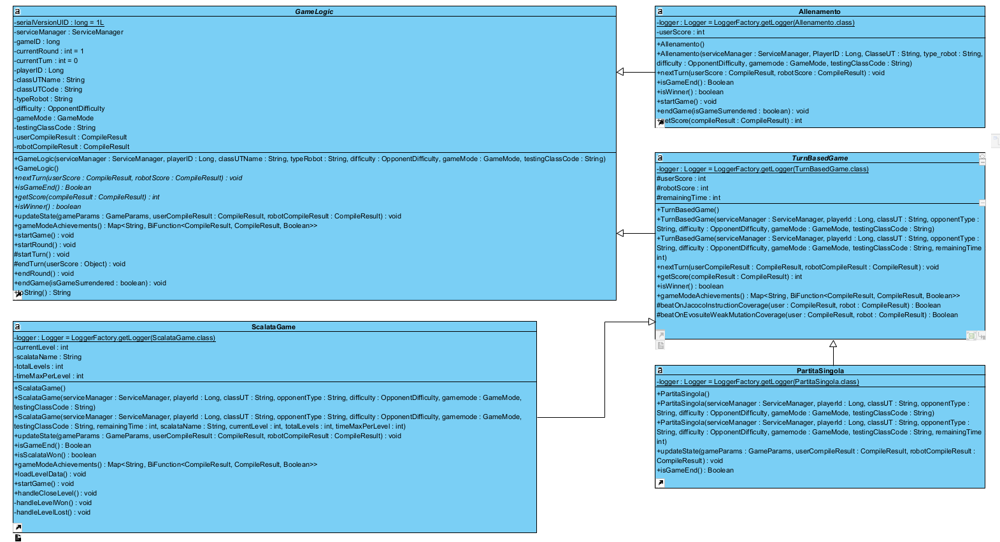
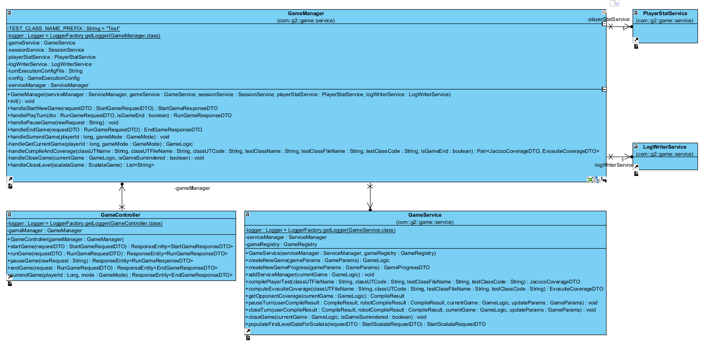
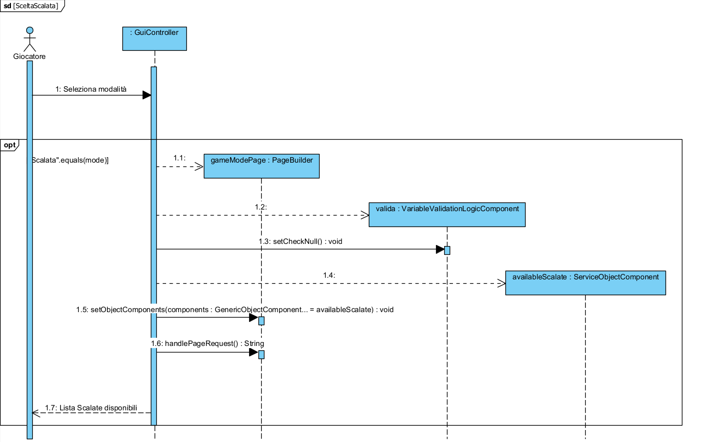

The **Game package** is dedicated to managing the logic of the various game modes within the application.
It represents the core of the **GameEngine**, providing structures and classes to implement, manage, and monitor games,
turns, and rounds.

## Structure and Role
The Game package is organized to allow the creation of multiple game types, all based on a common logic and consistent interface.
This approach facilitates the implementation of new games and modification of existing ones without impacting the rest of the application.

The workflow revolves around the **GameController**, whose main objective is to manage the lifecycle of a game in a smooth
and coherent way, ensuring a balanced and engaging experience for players.
The modular and extendable design of the controller allows easy extension of the logic to new games, enhancing the
flexibility of the game architecture.

## Class Diagrams: GameLogic

## Class Diagrams: GameManager & Controller

### Components
1. **GameController:** Acts as an intermediary between the client and the backend, handling routing related to games, coordinating the game lifecycle, and interacting with external services.
   It integrates a **ServiceManager** (see Interface package), as games often require communication with external services (e.g., saving results or retrieving new challenges). This integration provides ready-to-use HTTP calls and resource management for the user.
   Specifically:
    * Tracks active games in a map (`activeGames`), associating each game with a `playerId`.
    * Receives client requests (e.g., starting a game or executing a turn) via methods annotated with `@PostMapping` and `@GetMapping`.
    * Provides support methods, such as `getUserData` or `getRobotScore`, which retrieve required information from external service calls.

2. **GameManager**: Acts as the orchestrator of the game logic and serves as the primary entry point for the REST controller. It coordinates the execution flow of matches, managing interactions between different services employed to realize the game engine. Specifically:
    * Handles the complete game lifecycle through dedicated methods: `handleStartNewGame()` creates and initializes new games, `handlePlayTurn()` executes individual turns, `handleEndGame()` manages game termination, and `handleSurrendGame()` processes player forfeitures.
    * Delegates business logic operations to `GameService` while maintaining control over the orchestration flow, ensuring proper sequencing of compilation, coverage evaluation, session management, and achievement tracking.
    * Manages session persistence via `SessionService`, storing and retrieving `GameLogic` instances in Redis to maintain game state across HTTP requests.
    * Integrates `PlayerStatService` to calculate experience points and unlock achievements based on game outcomes and player performance.
    * Configures game execution behavior through `GameExecutionConfig`, loaded from `turn_execution_config.json`, which determines when EvoSuite metrics should be computed (e.g., only at game end to optimize performance).
   * Coordinates compilation and coverage evaluation through `handleCompileAndCoverage()`, orchestrating calls to both T7 (JaCoCo) and T8 (EvoSuite) services based on configuration and game state.

3. **GameService**: Encapsulates all operations necessary for game creation, retrieval, management, and closure at the backend level. It interfaces with specialized microservices (T7, T8, T4, T1, T23) through the `ServiceManager`, delegating operations for compilation, coverage calculation, progress tracking, and session management. Specifically:
    * Provides factory-based game instantiation via `GameRegistry`, which dynamically creates the appropriate `GameLogic` subclass (e.g., `TurnBasedGame`, `ScalataGame`, `TrainingGame`) based on the requested `GameMode`.
    * Manages game progress tracking through `createNewGameProgress()`, which creates or retrieves a `GameProgressDTO` representing the player's victories and unlocked achievements against specific opponents (identified by gameMode, classUT, opponentType, and difficulty).
    * Handles compilation requests to external services: `compilePlayerTest()` invokes T7 for JaCoCo coverage metrics, while `computeEvosuiteCoverage()` invokes T8 for EvoSuite metrics.
    * Manages opponent coverage retrieval through `getOpponentCoverage()`, either reusing cached results from the session or computing new ones via `CompileResult`.
    * Provides session state management methods: `pauseTurn()` updates game state without closing the turn (used when players temporarily leave), while `closeTurn()` executes the full turn logic including score calculation and turn advancement.
    * Handles game termination through `closeGame()`, which closes the current round, updates T4, and removes the session from Redis.
    * Supports Scalata mode by populating level-specific data from T1 via `populateFirstLevelDataForScalata()`, retrieving class names, opponent information, and time limits for each level.
    * Acts as an abstraction layer between `GameManager` and external microservices, isolating HTTP communication details and providing clean, type-safe interfaces for game operations.

4. **GameLogic:** Defines game concepts such as matches, rounds, and turns. Provides methods to create, play, and end a game.
   GameLogic defines the structure and rules of games, while subclasses extending GameLogic implement the specifics of each game mode.
   It does not directly interact with the client or HTTP requests; it handles internal game logic only.
   Subclasses must implement methods to define the specific game logic:
    * `playTurn()`: Defines the logic executed during each turn.
    * `isGameEnd()`: Defines the conditions for the end of the game.
    * `getScore()`: Calculates the player’s score based on specific metrics (e.g., code coverage).

5. **TurnBasedGame:** Extends GameLogic and provides a ready-made implementation managing turn transitions and victory/defeat conditions while maintaining a consistent game state.
   Implements the game logic specific to the **challenge** mode. TurnBasedGame gathers all common logic for `PartitaSingola` and `Scalata`. `Allenamento` has been kept separate from the hierarchy because it does not involve competitive confrontation nor a comparable turn-based dynamic.

## Use Case: Creating a New Game Mode
The system uses the abstract class GameLogic as a base for game logic management. To create a new game mode, derive a
new class from GameLogic and implement the three abstract methods: `playTurn()`, `isGameEnd()`, and `getScore()`, as well
as the `createGame()` method.

### Steps
1. **Create a New Class Extending GameLogic**: This class represents the new game mode.

2. **Implement the `playTurn()` Method**: Responsible for the logic executed each turn. May include creating new turns, collecting scores, and transitioning between game states.

3. **Implement the `isGameEnd()` Method**: Returns a boolean indicating whether the game has ended, based on the logic of the specific game mode.

4. **Implement the `getScore()` Method**: Calculates the player’s score according to a specific metric (e.g., code coverage, robot performance). The score is often influenced by the number of rounds played or performance during a turn.

5. **Integrate the New Mode into the System**: After creating the new game mode, integrate it into the system by registering it within the GameController or other components managing game types.

## Sequence Diagram: CreateGame
This diagram illustrates the process through which an authenticated user starts a new game.
After selecting game parameters (class and robot), the system sends the information to the backend, which creates the game and stores its details. The system then returns the newly created game ID to the user.

## Sequence Diagram: SelectScalata
This diagram illustrates the process through which an authenticated user selects a Scalata game.

