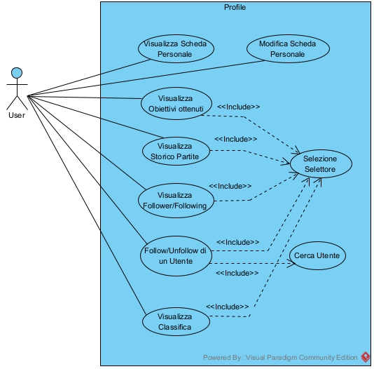
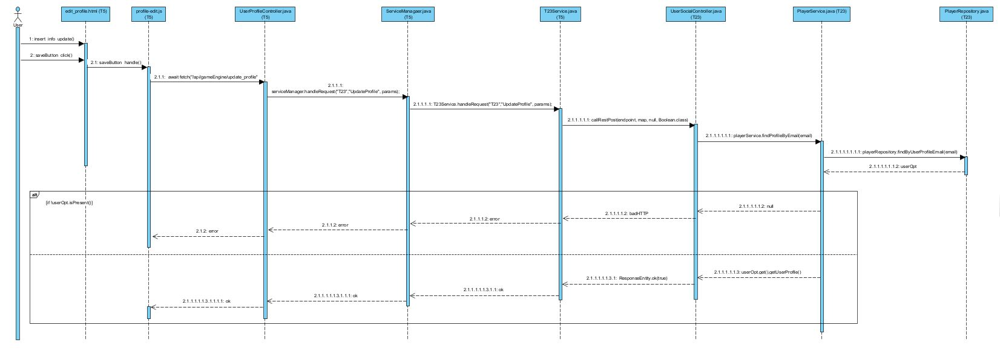
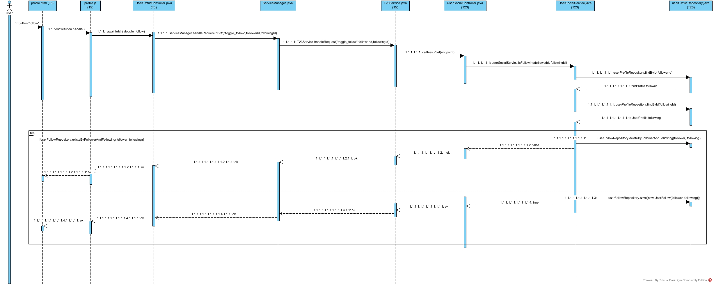

# GESTIONE DEL PROFILO UTENTE (GRUPPO D10, TASK R6)

Si presentano le principali modifiche apportate al sistema originale al fine di conseguire la corretta gestione del profilo utente.
A tal proposito, si inizia con la presentazione dell’insieme di requisiti che il sistema deve soddisfare:

- Visualizzazione dell’avatar e della bio del giocatore.
- Implementazione di un selettore per la visualizzazione di una parte variabile delle informazioni.
- Visualizzazione, nella parte variabile, del riepilogo delle statistiche, della classifica dei giocatori e dello storico delle partite.
- Implementazione della funzionalità di follow/unfollow per un altro utente.
- Visualizzazione della lista dei followers e dei following.

Di seguito sono riportati i casi d’uso a copertura dei requisiti individuati:



Nelle successive sezioni saranno descritte le modifiche implementative adottate per il conseguimento degli obiettivi prefissati.


# 1. Riorganizzazione della pagina Profilo

La pagina `profile.html` è stata trasformata da semplice vista riepilogativa a contenitore centrale delle funzionalità dell’utente, integrando leaderboard, achievements e cronologia partite tramite un’architettura a tab. Obiettivi della riorganizzazione sono:

- Evitare la frammentazione su più pagine dedicate.

- Consentire il caricamento dinamico dei contenuti tramite JavaScript.

- Recuperare i dati in modalità asincrona per migliorare reattività e esperienza utente.

## Introduzione dei nuovi tab

All’interno di `profile.html` sono stati aggiunti tab per:
 
- Achievements (`#pills-achievements`)

- Leaderboard (`#pills-leaderboard`)

Oltre ai tab preesistenti:

- Game History (`#pills-games`)

- Followers/Following (`#pills-followers`)

Ogni tab è progettato per contenere il proprio contenuto, con caricamento dei dati gestito dinamicamente.

## Modifica del comportamento dei tab

- Contenuti caricati solo al momento della selezione del tab (lazy loading).

- Le tabelle e le liste (Leaderboard, Game History, Achievements) vengono popolati tramite JavaScript.

- Alcune parti del codice, soprattutto nel tab Social, rimangono inline in HTML per motivi tecnici legati a ricerca e gestione follower/following.

## Inizializzazione variabili per il tab Achievement

Dati globali per Achievement (punti esperienza, livelli, achievements sbloccati, label tradotte e metadati) sono inizializzati lato server tramite Thymeleaf e resi disponibili a `Achievement.js`.
Esempio:

```java
window.ACH_userExp = /*[[${userCurrentExperience}]]*/ 0;
window.ACH_gamemode = /*[[${gamemode_achievements}]]*/ [];
window.ACH_general = /*[[${general_achievements}]]*/ [];
window.ACH_labels = { total_exp: /*[[#{total_exp_label}]]*/ "Punti esperienza totali" };
```


Questa configurazione evita fetch aggiuntivi per dati statici e mantiene coerenza con internazionalizzazione.

## Gestione del codice JavaScript nei tab

- Game History: gestito principalmente da `GameHistory.js` con caricamento asincrono.

- Achievements: gestito da `Achievement.js` che costruisce dinamicamente UI e progress bar.

- Leaderboard: gestito da `leaderboard.js` per fetch dei dati, costruzione tabella e ordinamento.

- Eccezioni: codice inline nei tab Social e Game History per corretto inizializzamento dei componenti.

# 2. Modifica del Profilo Utente

La funzionalità consente all’utente di modificare informazioni personali come biografia, immagine del profilo e nickname. Nella versione originale, la pagina mostrava dati di default senza possibilità di modifica. Le modifiche principali hanno riguardato sia il front-end sia il back-end per rendere l’operazione completa e coerente.

## Front-end
### `edit-profile.html` / `profile-edit.js`

Correzioni e aggiornamenti HTML:

- `userData` sostituito con `player-data` per leggere correttamente bio, immagine e altri dati.

- `user-email` aggiornato a `player-email` per gestire correttamente l’email dell’utente.

- Input hidden per email aggiunto per consentire l’uso da script esterni (es. `UserUtil.js`).

- Div notifications collegato a `notification.js` per mostrare messaggi e avvisi.

- Aggiunti campi per nickname (`nickname-input`) e label descrittive per immagini e bio.

`profile-edit.js` gestisce:

- Selezione dinamica delle immagini del profilo con aggiornamento di `selectedImage`.

- Lettura dei valori correnti di bio e nickname, con fallback in caso di campi vuoti.

- Invio dei dati modificati tramite fetch POST all’endpoint `/api/gameEngine/update_profile`, includendo email, bio, immagine e nickname.

- Gestione degli esiti della richiesta, con alert e redirect al profilo utente.

## Back-end

### UserProfileController.java

- `GET /edit_profile`: costruisce la pagina di modifica del profilo con PageBuilder, gestendo eccezioni tramite try-catch e utilizzando `player` come chiave nel modello coerente con il front-end.

- `POST /update_profile`: riceve i dati aggiornati dal front-end (email, bio, profilePicturePath, nickname) e invia la richiesta al Service Manager.

### T23Service.java

- Registrazione azione `UpdateProfile`: gestisce i parametri ricevuti dal front-end.

- Metodo `updateProfile(String userEmail, String bio, String imagePath, String nickname)`: invia i dati al servizio remoto tramite `callRestPost`, rendendo effettivo l’aggiornamento del profilo, inclusa la modifica del nickname.

## Sintesi del flusso

1. L’utente modifica bio, immagine o nickname sul front-end.

2. `profile-edit.js` costruisce la richiesta POST e la invia all’endpoint `/update_profile`.

3. UserProfileController riceve i dati e li inoltra a T23Service tramite `UpdateProfile`.

4. T23Service invia la richiesta al servizio remoto per aggiornare le informazioni nel database.

5. Il front-end riceve conferma del successo e aggiorna la UI, senza cambiare pagina.

Per una visione più dettagliata, si riporta il diagramma di sequenza che ha ispirito tale implementazione:



Questa implementazione garantisce un flusso completo e coerente tra front-end e back-end, permettendo modifiche immediate e sicure alle informazioni personali dell’utente.


# 3. Follow/Unfollow di un Utente

Per gestire il follow/unfollow, in `UserProfileController.java` è stato aggiunto l’endpoint POST `/toggle_follow`, che riceve gli ID dei due utenti coinvolti e restituisce un booleano indicante il successo dell’operazione. L’endpoint delega la logica al ServiceManager.

Nel `T23Service.java`, l’azione `toggle_follow` è registrata e il metodo `toggle_follow(String followerId, String followingId)` invia la richiesta POST al servizio remoto, garantendo coerenza nella comunicazione tra microservizi.

Si riporta il diagramma che ha ispirato l'implementazione di tale soluzione



(*Tale diagramma può essere preso come riferimento per comprendere il flusso di chiamate anche per le successive sezioni*)


# 4. Visualizzazione Follower/Following

La funzionalità consente all’utente di visualizzare i propri follower e i profili che segue. In `UserProfileController.java` sono stati aggiunti due endpoint REST: `/followers` e `/following`, che intercettano le richieste dal front-end e le inoltrano al ServiceManager.

Nel `T23Service.java`, le azioni `getFollowers` e `getFollowing` sono registrate tramite `ServiceActionDefinition` e comunicano con il servizio remoto responsabile delle relazioni sociali. I metodi `getFollowers(String userId)` e `getFollowing(String userId)` invocano chiamate REST (`callRestGET`) per ottenere le informazioni, esponendo funzionalità preesistenti senza accesso diretto al servizio remoto.

## Visualizzazione pulsante Follow/Unfollow

Per determinare se visualizzare “Follow” o “Unfollow”, è stato aggiunto l’endpoint `/isFollowing` in `UserProfileController.java` e la corrispondente azione `isFollowing` in `T23Service.java`, che restituiscono un booleano basato sullo stato del follow tra due utenti.

## Valutazione ID associato all’utente

Per i profili degli amici, il recupero dell’ID utente non può basarsi sul login dell’utente corrente. In `UserProfileComponent.java`, il metodo `getModel()` è stato aggiornato: se il profilo è di un amico (`isFriendProfile`), i dati vengono ottenuti tramite la nuova azione `GetUserByProfile` in `T23Service.java`, che chiama l’endpoint `/player/by/profile/{profileId}` esposto da UserSocialController.java, il quale utilizza `PlayerService.java` per ricavare l’utente dall’ID del profilo.

# 5. Nuovo Tab Leaderboard

La leaderboard è stata integrata come tab nella pagina del profilo, eliminando la pagina dedicata (`Leaderboard.html`). Il file `leaderboard.js` gestisce:

- fetch asincrono dei dati tramite la nuova rotta `/leaderboard/{userId}` in `UserProfileController.java`;

- costruzione dinamica della tabella e popolamento delle righe con ranking e punteggi;

- caricamento ritardato dei dati all’apertura del tab;

- ordinamento, ranking e paginazione lato client;

- evidenziazione del giocatore corrente.

Il controller utilizza LeaderboardComponent per costruire il modello dati e restituirlo in formato JSON, separando la logica dalla visualizzazione e migliorando l’esperienza utente.

# 6. Nuovo Tab Achievement

La sezione Achievements è stata trasformata in un tab dinamico all’interno del profilo, eliminando la pagina `Achievement.html`.

- `Achievement.js` gestisce fetch asincrono al backend (`/Achievement/{userId}`), mapping dei dati, animazione delle progress bar e raggruppamento per modalità di gioco.

- `Achievement.css` definisce lo stile per i badge e la progressione degli achievements.

- In `UserProfileController.java`, la rotta `getAchievementData(@PathVariable Long userId)` restituisce in JSON i punti esperienza, i progressi per modalità di gioco, gli achievements globali e configurazioni aggiuntive (`startingLevel`, `expPerLevel`, `maxLevel`), permettendo il rendering dinamico nel tab del profilo.

Questo approccio rende l’interfaccia più reattiva e coerente con il resto della UI.

# 7. Aggiornamento Tab Game History

La cronologia delle partite è ora un tab all’interno del profilo, con caricamento dinamico e paginazione lato client:

- `GameHistory.js` recupera i dati tramite chiamata AJAX a `/api/gamerepo/games/player/${playerId}`, ordina le partite per data e costruisce dinamicamente gli elementi HTML, includendo badge di vittoria/sconfitta e punteggi.

- `GameHistory.css` gestisce lo stile della lista e dei badge.

I dati precedentemente iniettati da Thymeleaf (modalità di gioco, difficoltà, etichette) sono ora gestiti direttamente in JS o come variabili globali. Questo garantisce caricamento rapido, navigazione fluida e coerenza con gli altri tab dinamici del profilo.

# 8. Gestione Internazionalizzazione

Tutte le sezioni del profilo utente (Achievements, Leaderboard, Game History e Social) supportano l’internazionalizzazione. I testi dell’interfaccia non sono hardcoded, ma forniti tramite file di message properties di Thymeleaf (`messages_it.properties`, `messages_en.properties`, `messages_es.properties`) e inizializzati in oggetti JavaScript globali.

Ogni tab legge le etichette dagli oggetti i18n dedicati, consentendo l’aggiornamento immediato dei testi al cambio lingua senza modificare l’HTML statico. Questa architettura centralizzata garantisce coerenza dell’interfaccia e semplifica l’aggiunta di nuove lingue.
