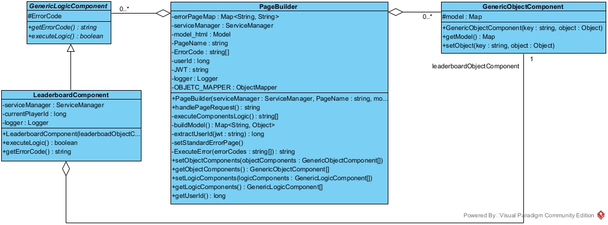

# Leaderboard Feature

## Overview
The Leaderboard feature introduces a competitive ranking system to the TestingRobotChallenge platform, allowing authenticated players to view and compare their performance against other users based on different scoring metrics.

This enhancement aims to increase player engagement by providing clear visibility of their standing within the community and encouraging continuous improvement through healthy competition.

## Key Features

The leaderboard provides two distinct ranking metrics:

1. **Experience Points Ranking**: players are ranked based on their total accumulated experience points earned by defeating robots throughout their gameplay.
2. **Unique Wins Ranking**: players are ranked by the number of unique victories achieved in Single Match mode. A victory is considered unique when defined by the triplet (class, robot, difficulty level). Multiple wins by the same user against the same robot, on the same class, and at the same difficulty level count as a single victory for this ranking.

### User Interface

Access to the leaderboard page is restricted to authenticated players only.

Players can access the leaderboard through the "Leaderboard" entry added to the ellipsis menu in the top-right corner of the application's homepage. This entry directs to the `/leaderboard` endpoint.

The interface includes:
- A sortable table displaying player rankings with first name, last name, email, and score;
- A personalized badge showing the current player's position and score;
- Dynamic sorting controls to switch between ranking metrics (`updateLeaderboard`);
- **Pagination:** Managed client-side through the `setupPagination` and `showPage` functions, displaying a maximum of 3 rows per page;
- **Row highlighting:** The row corresponding to the authenticated player is highlighted using the `.highlight-row` CSS class;
- Full multilingual support (Italian, English, Spanish).

## Implementation

### Frontend

The leaderboard page is implemented in the **T5** microservice using:
- **Thymeleaf** for server-side HTML template rendering (`leaderboard.html`) with native internationalization support;
- **JavaScript** (`leaderboard.js`) for client-side interactivity, handling sorting, pagination, and player highlighting;
- **CSS** (`leaderboard.css`) for styling consistent with the platform's existing design.

The frontend leverages data pre-loaded by the backend through Thymeleaf, storing player metrics in HTML `data-exp` and `data-wins` attributes for efficient client-side manipulation. When users switch between ranking metrics, JavaScript dynamically reorders the table, recalculates ranks using a **dense ranking** algorithm (where tied players share the same rank), and updates the personalized badge accordingly.

### Backend

The backend implementation involves modifications to two microservices: **T5** and **T23**.

#### T5 Service

The **T5** service handles the leaderboard page rendering and orchestration:

- **UserProfileController**: exposes the `/leaderboard` endpoint (GET request) that initializes the page components and delegates to the `PageBuilder` for view construction;
- **PageBuilder**: implements the Builder pattern to construct page models in a modular and maintainable way, coordinating between logic components and data components;
- **LeaderboardComponent**: contains the core logic (`executeLogic`) for retrieving player data, building leaderboard records, and populating the page model. It fetches player information from T23 via **ServiceManager** through REST API calls and transforms received data into `LeaderboardRecordDTO` objects.

#### T23 Service

The **T23** service provides player data through its REST API:

- **REST API:** T23 exposes a REST API at the `/players` endpoint (GET request) to return the list of all players and their game progress; this API in `PlayerController.java` was modified to return `PlayerDTO` objects instead of raw domain entities, following the **DTO pattern** for proper data transfer between microservices.

#### Data Transfer Objects

Two specialized DTO classes facilitate data exchange:

- **PlayerDTO**: encapsulates player identification and progress information retrieved from T23;
- **LeaderboardRecordDTO**: represents a single leaderboard entry, constructed from a `LeaderboardRecord`.

`LeaderboardRecord` class contains the methods `getPlayerExp` and `getPlayerWins` to retrieve the two ranking metrics used to build the leaderboard. To extend the leaderboard with other metrics it is necessary (but not sufficient) to modify this class.

## Multilingual Support

All user-facing text elements in the leaderboard interface are fully internationalized using Spring Boot's properties files (`messages_it.properties`, `messages_en.properties`, `messages_es.properties`). Thymeleaf automatically resolves the appropriate translations based on the user's selected language, ensuring a consistent experience across all supported locales.
